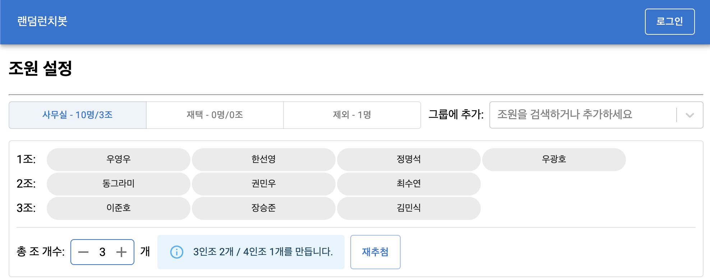

# 랜덤런치봇

맘편한세상 사내 랜덤런치를 진행하기 위한 랜덤런치봇 프론트엔드 UI입니다.

프론트 UI를 통해 슬랙에 있는 팀원들의 랜덤 조를 구성하고, 결과를 바로 슬랙에 전송할 수 있습니다.

현재는 https://random-lunch-bot-fe.vercel.app/ 을 통해 Vercel에 호스팅되어 있습니다. 아직 이 웹페이지를 통해서는 다른 조직에서의 사용이 불가능하며, 추후 확장될 계획입니다.

# 기술 스택

- 프론트엔드 + 백엔드: Next.js
- 데이터베이스: Supabase

# 필요한 SaaS 서비스

- Vercel: Vercel을 통해 배포되는 것을 가정합니다.
- Supabase: 계정 인증과 계정별로 Slack Oauth Token을 저장하기 위해 Supabase를 사용합니다.

# 실행 방식

먼저, 아래와 같은 환경변수가 필요합니다. `.env.local` 파일을 통해 만들어두면 됩니다.

- `NEXT_PUBLIC_SUPABASE_URL`: supabase의 Settings > API 페이지에서 확인 가능한 Project URL
- `NEXT_PUBLIC_SUPABASE_ANON_KEY`: supabase의 Settings > API 페이지에서 확인 가능한 Project API Anon Key
- `NEXT_PUBLIC_SLACK_BOT_CLIENT_ID`: 메세지를 전송하는 슬랙 봇의 Client ID
- `SLACK_BOT_CLIENT_SECRET`: 메세지를 전송하는 슬랙 봇의 Client Secret
- `NEXT_PUBLIC_SLACK_OAUTH_CALLBACK_HOST`: 슬랙 봇 연동 시, Slack Oauth Callback 요청을 받을 Host ( `https://random-lunch-bot-fe.vercel.app` 까지만 입력하면, Path는 어플리케이션에서 처리 )
- `REDIRECT_BACK_HOST`: 슬랙 봇 연동 시, 연동 완료 후 슬랙 다시 돌아올 페이지
